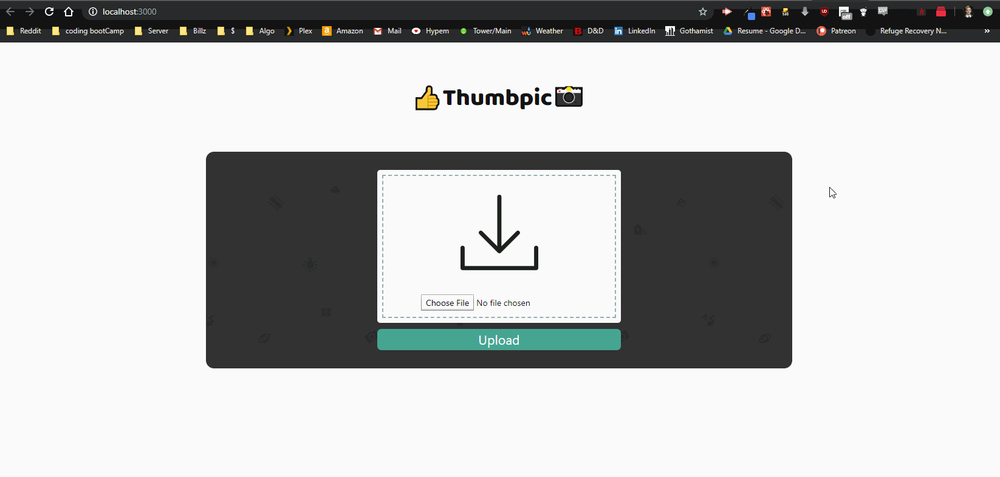

To pull: git clone https://github.com/mcintyrehh/pic-loader.git
then 

`cd pic-loader`

`npm install`

Add a '.env' file to root with the following information:

```
REACT_APP_AWS_ACCESS_KEY_ID=AccessKeyGoesHere
REACT_APP_AWS_SECRET_KEY=NoQuotesNecessary
REACT_APP_BUCKET=YourBucket
REACT_APP_BUCKET_KEY=KeyForBucket
```

`npm run start`

### Resonance Interview Test ###

* Build a basic file upload and view interface w/ AWS services
* Accept large img files up to 1GB 
* Use a combination of AWS services to generate a thumbnail for each file upload
* Display thubmails on interface once uploaded
* Convey to user that image thumbnail is being generated
* Display thumbnail once complete, without reloading the page


## Steps taken so far ##

* React app bootstrapped with create-react-app
* Basic front end skeleton created, using Ant Design UI framework 
* Created an AWS S3 bucket, opened for public access, CORS enabled from all ( * ) origins, and for GET, POST, PUT methods
* When the user uploads a picture it uses S3.putObject (configured as a promise) to add an object to the bucket
* When the promise resolves a lambda function is invoked to compress the image with the npm 'gm' package (will probably look into a different package for this part)

Logic for the loading gif: 
``` javascript
<div 
  className="form-container" 
      style={{backgroundImage: `url(${
      // ternary operator that checks to see if the img is loading, if it is, display loading url
      // if it isn't: display the generated thumbnail if it exists, else the default upload icon
      this.state.generating ? 
      this.displayIcons.loading.url : (this.state.imageUrl || this.displayIcons.default.url) })`}}>
</div>
```

## Whats left ##

* Right now larger files are filling up GraphicsMagick buffer and failing to resize
* Currently sending a dummy S3 event to the lambda function for easier integration if I wanted to configure it to automatically run when an object was uploaded to the bucket
